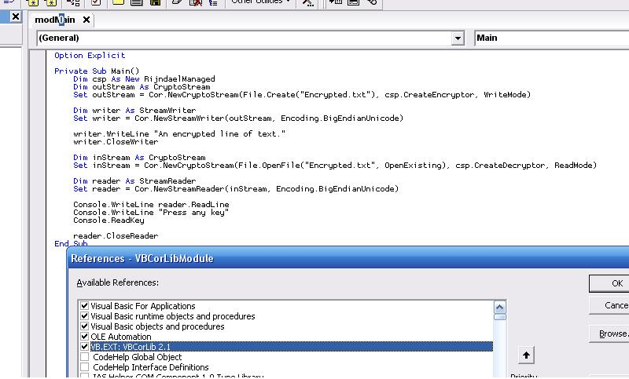



## VBCorLib 2\.3 \(Jun\-10\-2008\)

### Description

** Version 2.3 ** Updated a few classes and made it more DEP compatible. Added the BigInteger class and fixed a few issues.

Fixed Wide Character API support on NT machines, along with a couple minor fixes. What's new with this version? Cryptography! In addition to the hundreds of existing useful classes implemented, now most of the cryptography classes in the DotNET core library (mscorlib.dll) have been implemented as well! By using all available standards, each supported cryptography class has been implemented to provide VB6 developers a diverse array of choices. Everything from two-way ciphers (eg. Rijndael, DES, 3DES, RC2) and hashes (eg. SHA-1, SHA-256, SHA-384, SHA-512, MD5, RIPEMD160) to Message Authentication Code implementations (all of the hashes are supported). There are several more utility classes, such as Rfc2898DeriveBytes that generates keys based on text passwords using the RFC2898 published standard. All of these classes are compatible with DotNET produced data and vise-versa. There is too much to post it all in this window. If you have any questions, please post them at my website: http://www.kellyethridge.com/vbcorlib. I'll also be adding new tutorials to cover more ground of the new additions.
 
### More Info
 

             |
---                |---
**Submitted On**   |2008-06-08 19:05:16
**By**             |[Kelly S\. Ethridge](https://github.com/Planet-Source-Code/PSCIndex/blob/master/ByAuthor/kelly-s-ethridge.md)
**Level**          |Advanced
**User Rating**    |5.0 (190 globes from 38 users)
**Compatibility**  |VB 6\.0
**Category**       |[Libraries](https://github.com/Planet-Source-Code/PSCIndex/blob/master/ByCategory/libraries__1-49.md)
**World**          |[Visual Basic](https://github.com/Planet-Source-Code/PSCIndex/blob/master/ByWorld/visual-basic.md)
**Archive File**   |[VBCorLib\_22116086112008\.zip](https://github.com/Planet-Source-Code/kelly-s-ethridge-vbcorlib-2-3-jun-10-2008__1-66874/archive/master.zip)

